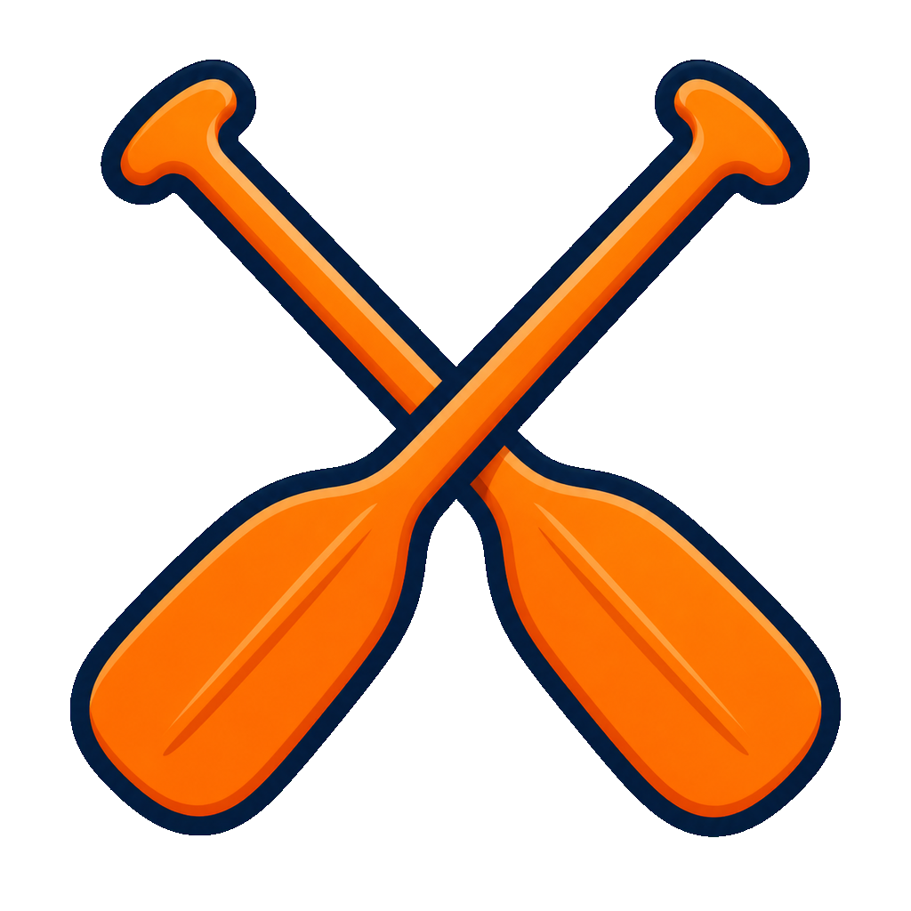

<p align="center">
  
</p>

# oarlock

Self-hosted workflow automation: a drag-and-drop canvas builder backed by an
event-driven Go engine on [River](https://riverqueue.com) (Postgres-backed
queue). Every workflow is also an MCP tool an AI agent can call.

See [docs/project.md](docs/project.md) for the design, current features, and
remaining work. This repository is currently [unlicensed](LICENSE.md).

## One image, two shapes

`ghcr.io/rustyguts/oarlock` is a single container with the Go engine, the
REST API, and the embedded web UI. `OARLOCK_MODE` picks its role:

| Mode | What runs | Use |
|---|---|---|
| `all` (default) | UI + API + workers in one process | single-container installs |
| `api` | UI + API only (inserts jobs) | HA: scale the HTTP tier |
| `worker` | workers + scheduler + reaper (`/healthz` only) | HA: scale run execution |

Only Postgres is required; Valkey is optional (live UI updates degrade to
polling without it).

## Layout

- `engine/` — Go core: REST API + River workers (`advance_run` /
  `execute_task` / `resume_task`), step executors, secrets vault, embedded
  migrations, embedded web UI. Run state lives in Postgres rows; workers are
  stateless.
- `web/` — SvelteKit UI (static SPA, embedded into the Go binary at image
  build): dashboard, workflow list, Svelte Flow canvas editor, run
  history/detail with live updates, secrets + MCP configuration.
- `deploy/chart/oarlock/` — Helm chart (simple and scalable modes).
- `docs/` — the project document.

## Quickstart (Docker Compose)

Requires Docker.

```sh
make up      # build + start Postgres 18, Valkey 9, and oarlock
open http://localhost:9000        # web UI (served by the same binary as the API)
make logs    # tail oarlock
make down    # stop everything
```

Ports: oarlock (UI + API) **9000**, Postgres 5432 (`oarlock`/`oarlock`),
Valkey 6379.

Create a workflow in the UI, drag steps onto the canvas (HTTP Request,
Transform, Code, Delay, Wait for Callback, AI Prompt, MCP Tool), connect
them, then hit Run. String config fields take `{{ }}` expressions against
`input`, upstream `steps.<key>` outputs, and `secrets.<name>`, e.g.
`{{ steps.fetch.body.title }}`.

Workflows fire from webhooks (`POST /hooks/{workspace}/{path}`), cron
schedules, the UI, or an MCP client pointed at `/mcp` with a workspace API
token (created under **MCP Access**).

## Kubernetes (Helm)

The chart in `deploy/chart/oarlock` installs either shape:

```sh
# simple: one all-in-one pod + bundled single-node Postgres and Valkey
helm install oarlock deploy/chart/oarlock \
  --set config.masterKey=$(openssl rand -hex 32)

# scalable: N api pods + M worker pods against your own database
helm install oarlock deploy/chart/oarlock \
  --set mode=scalable \
  --set replicas.api=2 --set replicas.worker=3 \
  --set postgres.enabled=false \
  --set config.databaseUrl=postgres://user:pass@db:5432/oarlock \
  --set config.masterKey=$(openssl rand -hex 32)
```

See `deploy/chart/oarlock/values.yaml` for ingress, existing-secret, and
resource options; `deploy/chart/test.sh` runs the chart's checks.

## Local development

```sh
# engine (needs the compose postgres + valkey running)
cd engine && go run ./cmd/api

# web dev server on :3001, talking to the API on :9000
cd web && bun install && cp .env.example .env && bun run dev

# tests
cd engine && go test ./...        # DB-backed tests self-skip without Postgres
cd web && bun run check && bun run test:unit
cd web && bun run test:ui         # Playwright visual regression (no backend)
./deploy/chart/test.sh            # helm chart checks
```

Set `OARLOCK_MASTER_KEY` (64 hex chars, `openssl rand -hex 32`) before
storing real secrets — without it a built-in dev key is used and the UI shows
a warning.

## Releases

Two channels, both publishing `ghcr.io/rustyguts/oarlock` (the repo is v0 —
only minor and patch releases for now):

- **dev** — every push to `main` cuts a prerelease (`vX.Y.Z-dev.N` tag +
  GitHub prerelease) and pushes image tags `X.Y.Z-dev.N` and `dev`. No
  version-bump commits land on `main`; versions derive from git tags.
- **production** — the *Release* workflow (Actions → Release → Run workflow,
  pick `patch` or `minor`) bumps the version everywhere
  (`package.json`, `Chart.yaml`, the API's version constant) in a release
  commit, tags `vX.Y.Z`, publishes a GitHub Release, and pushes image tags
  `X.Y.Z` and `latest`.
